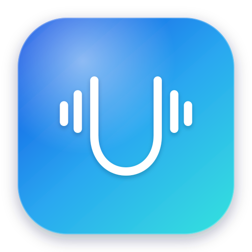
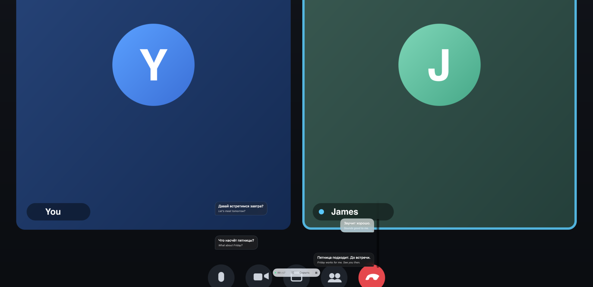
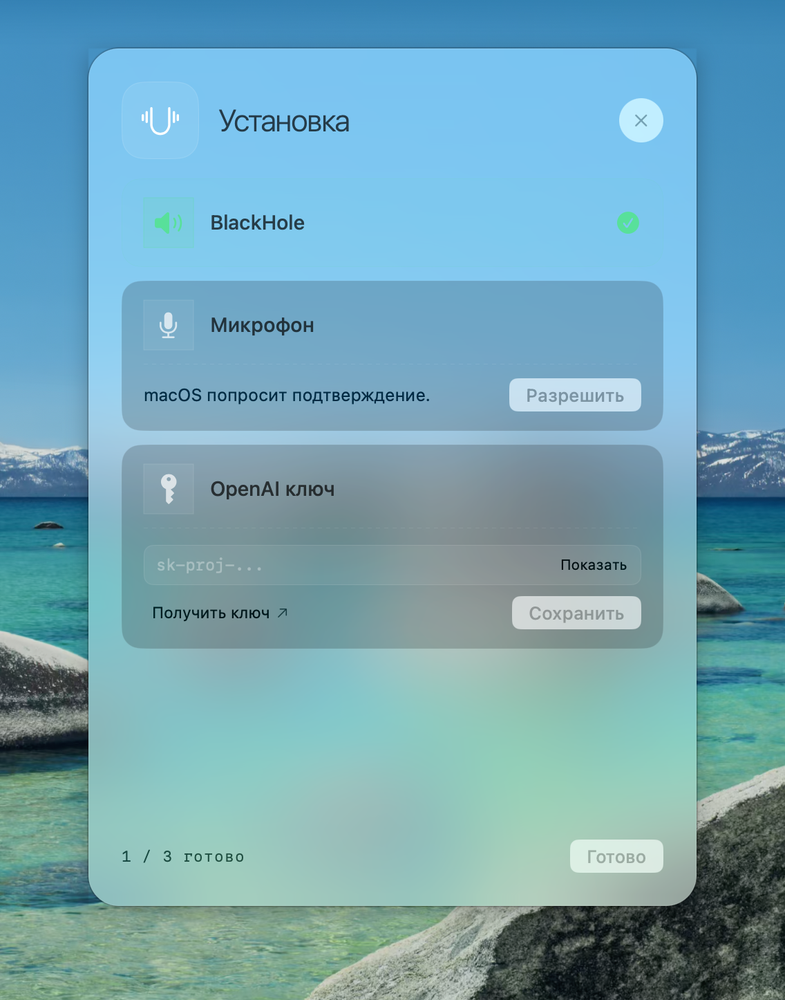
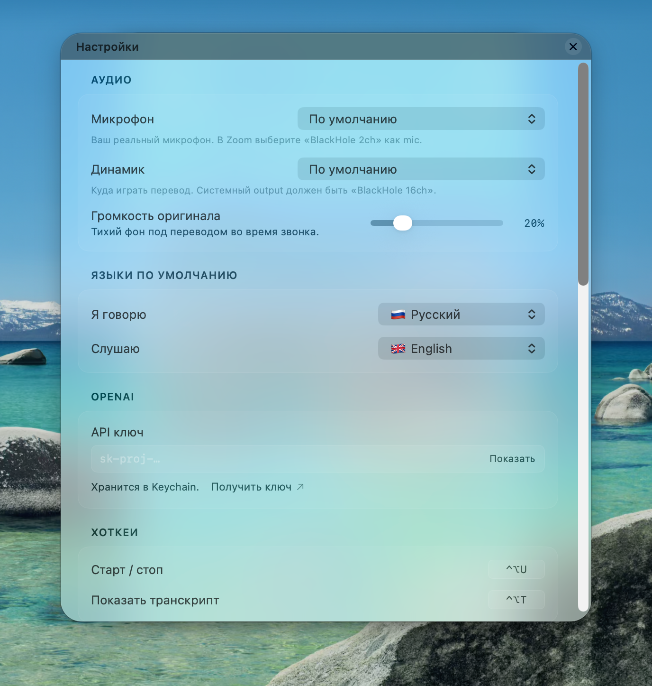
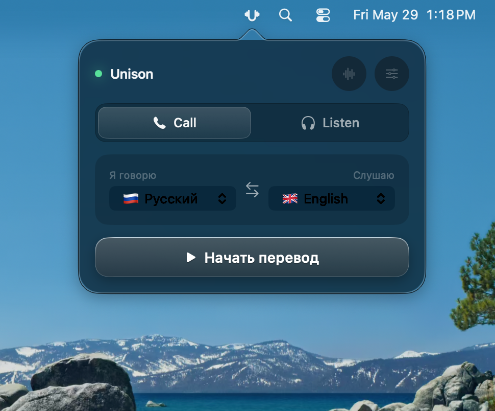

<div align="center">



# Unison

### Real-time voice translation for video calls

You speak your language — your peer hears theirs. They reply — you hear yours.
Unison sits in your menu bar and translates both directions of a live call,
in real time, so the conversation just flows.

[](https://www.apple.com/macos/)
[](https://swift.org)
[](https://github.com/NIK-TIGER-BILL/unison/actions/workflows/ci.yml)

<br>



</div>

---

## Overview

Video calls break down the moment two people don't share a language. Unison
removes that wall without anyone installing anything on the other end.

It runs as a menu-bar app and bridges your call in **both directions**:

- **Incoming** — it captures the call's audio (what your peer says), translates
  it, and plays it back to you in your language.
- **Outgoing** — it captures your microphone, translates it, and feeds the
  result into a virtual microphone that you select inside Zoom / Meet / Teams —
  so your peer hears you in *their* language.

Translation runs on a realtime WebSocket endpoint — your choice of
**OpenAI `gpt-realtime-translate`** or **Google Gemini `gemini-3.5-live-translate-preview`** —
so latency stays conversational. Pick your engine in onboarding or Settings;
each stores its own API key in the macOS Keychain. The whole UI is built on
macOS 26 Tahoe's native **Liquid Glass**.

---

## Screenshots

The live transcript is up top. The rest of the app:

<table>
  <tr>
    <td width="50%" valign="top">
      <br>
      <sub><b>Setup</b> — a guided three-step onboarding: install the virtual
      audio driver, grant the mic, choose a translation engine and paste your API key.</sub>
    </td>
    <td width="50%" valign="top">
      <br>
      <sub><b>Settings</b> — pick input/output devices, the language pair, manage
      the API key, and remap hotkeys.</sub>
    </td>
  </tr>
</table>

<div align="center">
  <br>
  <sub><b>Menu bar</b> — choose your direction and language pair, then start a
  session in one click.</sub>
</div>

---

## Features

- **Bidirectional, real-time** — translates the call's audio *and* your mic at
  the same time, continuously.
- **Drop-in for any call app** — routes your translated voice through a virtual
  microphone, so it works with Zoom, Google Meet, Teams, FaceTime — anything
  that lets you pick a mic.
- **Live transcript** — a floating glass window with the original and translated
  text for both speakers.
- **Hear the original underneath** — the untranslated voice plays quietly under
  the translation, so the call still feels human (volume is adjustable).
- **Menu-bar native** — no Dock icon, no window clutter. Start/stop and the
  transcript are a hotkey away (`⌃⌥U` / `⌃⌥T`).
- **Choice of translation engine** — OpenAI `gpt-realtime-translate` (13 target
  languages) or Google Gemini `gemini-3.5-live-translate-preview` (~28 target
  languages). Pick in onboarding or Settings; switching applies on the next session.
- **Keys stay local** — your API keys (one per engine) live in the macOS Keychain,
  never on disk.
- **Liquid Glass throughout** — built on Tahoe's native glass APIs.

---

## How it works

```
INCOMING  (peer → you)
  call audio ──▶ Process Tap (CoreAudio) ──▶ resample to engine rate
            ──▶ TranslationStream (OpenAI or Gemini, WebSocket)
            ──▶ resample 48 kHz ──▶ AGC + adaptive pacing ──▶ your speakers

OUTGOING  (you → peer)
  microphone ──▶ resample to engine rate
            ──▶ TranslationStream (OpenAI or Gemini, WebSocket)
            ──▶ resample 48 kHz ──▶ AGC ──▶ BlackHole 2ch  ◀── selected as your
                                                                mic in the call app
```

Two key pieces make the "no install on the other end" trick work:

1. **A CoreAudio Process Tap** captures the meeting's audio at the system level —
   no screen recording required.
2. **A BlackHole 2ch virtual device** receives your translated voice. You set it
   as your microphone inside the call app, and your peer hears the translation
   as if it came from your mic.

On top of that, a client-side **AGC** and an **adaptive playback pacer** keep the
translated audio at a steady level and cadence even when the model's output
arrives in bursts. The full, gory details (model quirks, the amplitude-fade bug,
pacing constants, diagnostic env-vars) live in
**[docs/audio-pipeline.md](docs/audio-pipeline.md)**.

---

## Supported languages

The available target languages depend on your chosen engine:

- **OpenAI** `gpt-realtime-translate` — **13 target languages**: Russian, English,
  Spanish, French, German, Italian, Portuguese, Chinese, Japanese, Korean, Hindi,
  Indonesian, Vietnamese. Auto-detects 70+ source languages.
- **Gemini** `gemini-3.5-live-translate-preview` — **~28 target languages** (a curated
  subset of its 70+ capabilities), with a broader selection than OpenAI.

Switching engines coerces the language pair to the new engine's supported set.
Pick the pair (*"I speak"* / *"I listen"*) in the menu-bar popover or in Settings.

---

## Requirements

- **macOS 26 (Tahoe)** or later — the UI uses native Liquid Glass APIs with no
  backports.
- An **API key** for your chosen translation engine — OpenAI (`gpt-realtime-translate`)
  or Google Gemini (`gemini-3.5-live-translate-preview`). You can add both and switch
  at any time.
- The **BlackHole 2ch** virtual audio driver — Unison installs it for you during
  onboarding.
- To build from source: a **Swift 6.2** toolchain (recent Xcode or the Command
  Line Tools).

---

## Getting started

```bash
git clone https://github.com/NIK-TIGER-BILL/unison.git
cd unison

# Build the .app bundle → build/Unison.app
bash scripts/bundle_app.sh

open build/Unison.app
```

On first launch, onboarding walks you through three steps:

1. **Install BlackHole** — the virtual microphone your peer will "hear".
2. **Grant microphone access** — so Unison can translate what you say.
3. **Choose a translation engine and add its API key** — OpenAI or Gemini; stored in
   the Keychain. You can add both and switch in Settings.

Then, in your video-call app, select **BlackHole 2ch** as the microphone. Press
`⌃⌥U` to start translating.

---

## Development

```bash
# Build all targets
swift build

# Run from source
swift run Unison

# Run with mocked audio capture + permissions (no TCC prompts, no real driver).
# The synthetic source plays predefined test tones so you can exercise the
# onboarding / settings / transcript flows end-to-end.
UNISON_DEV_MODE=1 swift run Unison

# Override API keys per engine (bypasses Keychain — useful in CI / VMs)
UNISON_API_KEY=sk-...        # OpenAI key override
UNISON_GEMINI_API_KEY=AI...  # Gemini key override
```

### Build, sign & run in one command

```bash
make run        # = scripts/run.sh — builds, bundles, and launches build/Unison.app
```

A single-instance guard means launching a fresh build terminates the
previous one, so you won't accumulate menu-bar icons across rebuilds.

### Stop the per-rebuild permission & keychain prompts

Ad-hoc-signed dev builds get a fresh code signature on every rebuild, so
macOS treats each build as a new app and re-asks for microphone / system-
audio permission (TCC) and the login keychain (your OpenAI key). Create a
stable self-signed signing identity **once**:

```bash
make dev-cert   # = scripts/make_dev_cert.sh — creates "Unison Dev" in your keychain
```

After that, `make run` (or `SIGN_IDENTITY="Unison Dev" scripts/bundle_app.sh`)
signs with that stable identity, so you grant permissions and the keychain
once and never again. The first build asks once to let codesign use the new
key — click **Always Allow**.

> Production builds are unaffected: the release pipeline signs with a real
> Developer ID, so end users grant everything once, ever.

### Tests

```bash
# Full suite (wrapper works on Command Line Tools-only machines)
./scripts/test.sh

# A single target
./scripts/test.sh --filter UnisonDomainTests

# Visual-regression snapshots (CGImage diffs, no external deps)
./scripts/test.sh --filter UnisonUITests

# Re-record snapshots — overwrites every PNG under __Snapshots__/
RECORD_SNAPSHOTS=1 ./scripts/test.sh --filter UnisonUITests
```

### UI screenshots

The screenshots in this README are produced reproducibly inside an isolated
macOS Tahoe [Tart](https://tart.run) VM — so capturing them never touches your
host's Keychain, defaults, or audio devices:

```bash
bash scripts/vm-screenshot.sh                       # capture every surface
bash scripts/vm-screenshot.sh transcript settings   # a subset
UNISON_SHOT_PADDING=64 bash scripts/vm-screenshot.sh # add margin around windows
```

See **[scripts/VM_README.md](scripts/VM_README.md)** for the harness details.

---

## Architecture

Unison is a Swift Package split into focused modules:

| Module | Responsibility |
| --- | --- |
| `UnisonDomain` | Core models — sessions, state, languages, transcript store. |
| `UnisonTranslation` | Translation clients (WebSocket) — OpenAI and Gemini, behind a shared `TranslationStream` interface. |
| `UnisonAudio` | Capture (Process Tap), resampling, playback, AGC, pacing, BlackHole output. |
| `UnisonSystem` | System integration — permissions, BlackHole install, Keychain. |
| `UnisonUI` | SwiftUI views and the Liquid Glass surface treatment. |
| `UnisonApp` | App composition, AppKit windows, the menu-bar item. |

Two CLI tools live under `Sources/Tools/`: `tap-benchmark` (Process Tap latency)
and `pacing-eval` (runs audio through the production chain offline).

Architecture notes — the two Liquid Glass backends, window machinery, and test
mode — are documented in **[CLAUDE.md](CLAUDE.md)**.

---

<div align="center">
<sub>Built for macOS 26 Tahoe · Liquid Glass · OpenAI Realtime · Google Gemini Live</sub>
</div>
